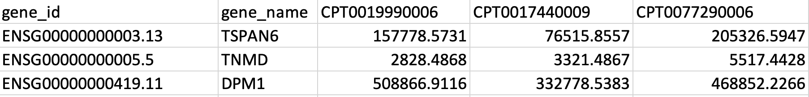

# TULIP - TUmor CLassIfication Predictor 

Tool to classify RNA-seq samples into different tumor types.

## Description

TULIP (TUmor CLassIfication Predictor) is a 1D convolutional neural network for classifying RNA-Seq data with [60K genes](https://github.com/CBIIT/TULIP/blob/main/gene_lists/all_genes.txt) or [19K protein coding genes](https://github.com/CBIIT/TULIP/blob/main/gene_lists/protein_coding_genes.txt) into [17](https://github.com/CBIIT/TULIP/blob/main/labels/17_tumors.csv) or [32](https://github.com/CBIIT/TULIP/blob/main/labels/17_tumors.csv) tumor types. 

The models used in TULIP were trained and validated on over 9,000 TCGA RNA-seq files from the Genomic Data Commons (GDC) in February 2022. To use TULIP, the user must provide a file of RNA-seq data expressed as FPKM-UQ for one or more samples. TULIP then converts FPKM-UQ values to TPM and performs other preprocessing steps before applying the selected model. Two files are generated - one file [(example)](https://github.com/CBIIT/TULIP/blob/main/example_results/predictions_17_all.csv) with only the predicted primary tumor types and their probability scores and a second file [(example)](https://github.com/CBIIT/TULIP/blob/main/example_results/predictions_full_17_all.csv) with the probabilitity scores for each tumor type for reference.

## Software Setup

To set up the Python environment for TULIP:
1. Install [conda](https://docs.conda.io/en/latest/) package manager. 
2. Clone this repository. 
3. Create the environment as shown below.

```bash
   conda env create -f environment.yml -n tulip
   conda activate tulip
```

## Downloading Model Weights

To download the model weights needed for running TULIP:
1. Create an account on the Model and Data Clearinghouse [MoDaC](https://modac.cancer.gov). 
2. Follow the instructions below to set up a folder called *models* with the weights.
3. When prompted, enter your MoDaC credentials.

## Data Setup

TULIP accepts CSV, XLSX, and TSV file formats. 

The data must be arranged with the Ensembl IDs in the first column and the expression values starting from the third column.



Example files with 60K genes and 19K protein coding genes are provided in [example_data](https://github.com/CBIIT/TULIP/tree/main/example_data). The samples included in these files were obtained from [GDC](https://portal.gdc.cancer.gov/). 

## Running TULIP

```bash
python tulip.py -i -i <path/to/file> [options]
```

Example:

```bash
python tulip.py -i example_data/all_genes_htseq_fpkm_uq.csv -t 17 -g all -o example_results/
```

Parameters:

Required
 * -i, --input = the full path of the gene expression matrix file (FPKM-UQ) in the required format

Optional
 * -t, --types = the number of tumor types, 17 or 32 (default), to use for classification
 * -g, --genes = indicate 'all' to use all 60K genes or 'pc' (default) for protein coding genes only
 * -o, --output_dir = the full path to the output directory
 * -m, --min_score = the minimum probability score (0.0 to 1.0) for keeping the predicted primary tumor type

## Acknowledgments

TULIP is based on [NCI-DOE-Collab-Pilot1-Tumor-Classifier](https://github.com/CBIIT/NCI-DOE-Collab-Pilot1-Tumor-Classifier).

This work has been supported in part by the Joint Design of Advanced Computing Solutions for Cancer (JDACS4C) program established by the U.S. Department of Energy (DOE) and the National Cancer Institute (NCI) of the National Institutes of Health.
